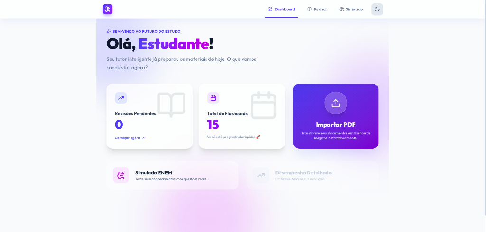
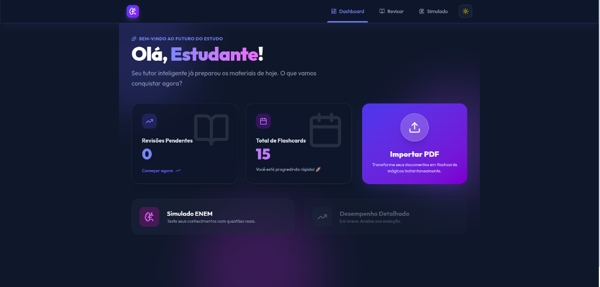
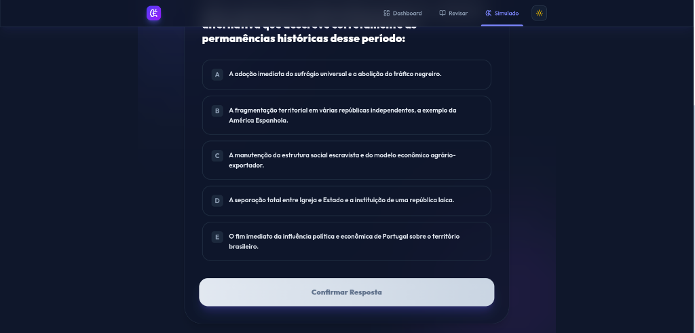
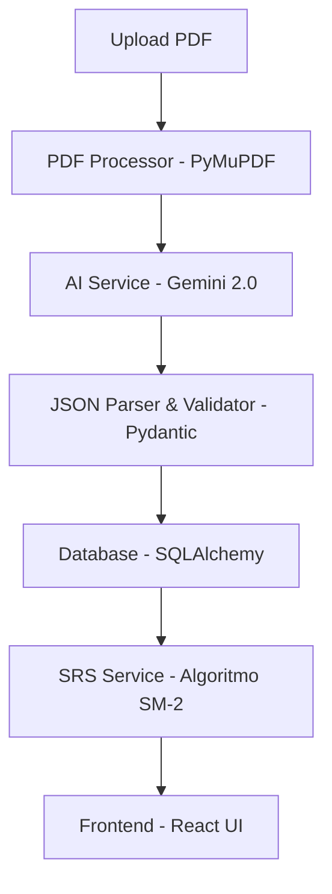

# StudyFlow AI 🧠📚

O **StudyFlow AI** é uma plataforma inteligente de aprendizado que transforma documentos e materiais de estudo (como PDFs) em flashcards e questões automaticamente utilizando Inteligência Artificial. Ele não é apenas um gerador de conteúdo, mas sim um sistema completo de retenção de conhecimento baseado em repetição espaçada.

---

## Visual do Projeto 📸

### Dashboard (Light & Dark Mode)
<div align="center">
  
  
</div>

### Flashcards e Estudo
<div align="center">
  
  
  
</div>

### Simulados ENEM
<div align="center">
  
  
</div>

---

## Tecnologias Utilizadas 🚀

### Backend & Inteligência Artificial
- **Python 3.12+**: Linguagem base pela sua robustez em IA e processamento de dados.
- **FastAPI**: Framework web moderno e de alta performance, utilizando tipagem estática e assincronismo.
- **SQLAlchemy**: ORM para abstração da camada de banco de dados (SQLite para dev, PostgreSQL pronto para prod).
- **Google Gemini API (2.0 Flash)**: Engine de IA de última geração para processamento de linguagem natural e extração semântica.
- **Poetry**: Gestão de dependências moderna e determinística.

### Frontend
- **React.js + Vite**: SPA rápida com hot-reload e build otimizado.
- **Tailwind CSS**: Design system utilitário para interfaces responsivas e suporte nativo a Dark Mode.
- **Framer Motion**: Orquestração de animações complexas para a experiência de Spaced Repetition (SRS).

---

## Arquitetura & Engenharia 🏗️

O projeto foi construído seguindo princípios de **Clean Architecture** e **SOLID**, garantindo que o software seja fácil de manter e escalar.

### Diagrama de Fluxo (Data Flow)


### Diferenciais de Engenharia
- **Algoritmo SM-2 (SRS)**: Implementação do algoritmo de repetição espaçada de SuperMemo-2. O sistema calcula o `intervalo`, `fator-e` e `revisão` de cada card baseado no feedback do usuário, otimizando a curva de esquecimento.
- **Data Integrity**: Uso rigoroso de modelos **Pydantic** para garantir que a saída da IA (que é não-determinística por natureza) seja validada e tipada antes de atingir o banco de dados.
- **Decoupling**: A lógica de negócio (Services) está isolada das rotas da API e da infraestrutura (Database/PDF), facilitando testes unitários e troca de provedores de IA.

---

## Segurança & Boas Práticas 🔒

- **Gestão de Segredos**: O projeto utiliza variáveis de ambiente via `.env`. Nunca commitamos chaves de API. Veja o arquivo `.env.example` para referência.
- **Proteção de Dados**: Validação de arquivos no upload para prevenir injeções e processamento de PDFs maliciosos.
- **CORS**: Configurado para permitir apenas origens autorizadas em ambiente de produção.

---

## Como Rodar o Projeto ⚙️

### 1. Requisitos Próximos
- Docker & Docker Compose **OU** Python 3.12+ e Node.js 18+.
- Uma `GOOGLE_API_KEY` válida (obtenha em [AI Studio](https://aistudio.google.com/)).

### 2. Configuração do Ambiente
Clone o repositório e configure seu arquivo `.env`:
```bash
cp .env.example .env
# Edite o .env com sua chave do Google Gemini
```

### 3. Rodando com Docker (Recomendado)
```bash
docker-compose up --build
```
A API estará disponível em `http://localhost:8000` e o frontend em `http://localhost:5173`.

### 4. Rodando Localmente (Desenvolvimento)

**Backend:**
```bash
# Usando Poetry
poetry install
poetry run uvicorn main_api:app --reload
```

**Frontend:**
```bash
cd studyflow-ui
npm install
npm run dev
```

---

## Licença 📄

Este projeto está sob a licença MIT. Veja o arquivo [LICENSE](LICENSE) para mais detalhes.

---
Desenvolvido com 💜 por **Luan Estifer Rodrigues Pereira (Zsubzeroz)**. 
[GitHub Repository](https://github.com/Zsubzeroz/studyflow-ai)
